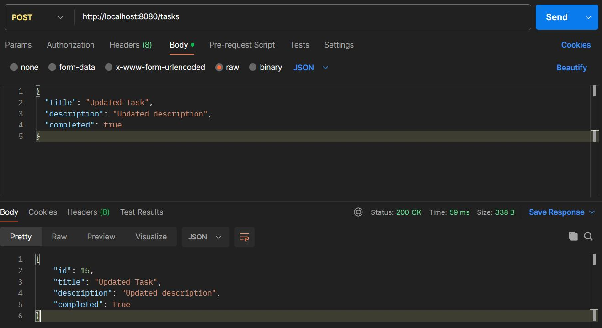

# Task Management System (Java Spring Boot Application)

## Project Overview
This is a backend project built using Spring Boot. It allows users to manage tasks like creating, updating, deleting, and viewing tasks.

---
## Tech Stack
* Java
* Spring Boot
* Spring Data JPA
* MySQL
* Maven
  
---
## Features
* Create Task
* Get All Tasks
* Get Task by ID
* Update Task
* Delete Task

---
## API Endpoints

| Method | Endpoint    | Description     |
| ------ | ----------- | --------------- |
| GET    | /tasks      | Get all tasks   |
| GET    | /tasks/{id} | Get task by ID  |
| POST   | /tasks      | Create new task |
| PUT    | /tasks/{id} | Update task     |
| DELETE | /tasks/{id} | Delete task     |

---
## How to Run
1. Clone the repository
2. Open in Eclipse / IntelliJ
3. Configure MySQL in `application.properties`
4. Run `TaskManagementSystemApplication.java`
5. Open browser:
   http://localhost:8080/tasks

---
## Sample Request (POST)

Use Postman:
POST /tasks

Body:
{
"title": "Complete Project",
"description": "Finish backend project",
"status": "Pending"
}

### Postman Output

---
## Author
Nishad Salvi
